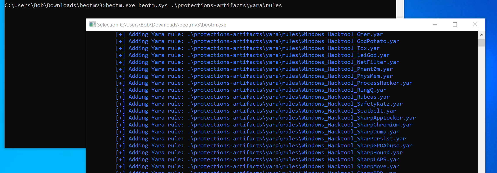
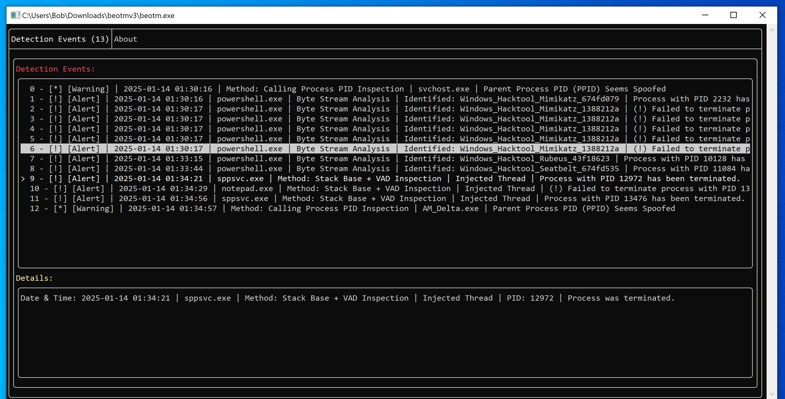

# <a href="https://xacone.github.io/BestEdrOfTheMarketV3.html"> Best EDR Of The Market (BEOTM) V3 🐲🏴‍☠️ </a>


Best Edr Of The Market is an open-source lab designed to implement and understand, from a low-level perspective, the detection methods used by Endpoints Detection & Response security products and their workarounds. These techniques are mainly based on the exploitation of Windows NT's telemetric capabilities to dynamically analyze process behavior.

<div align="center">
<u><b><a href="https://xacone.github.io/BestEdrOfTheMarketV3.html">➡️​ What's New in the Kernel Version of BestEdrOfTheMarket? </a></b></u>
</div>

<h2>Defensive Capabilities</h2>
This current version (v3) focuses on some of the interception capabilities offered by the Windows kernel. These include:
<br><br>

- [x] <a href="https://xacone.github.io/BestEdrOfTheMarketV3.html#4"> System Calls Interception via Alternative System Call Handlers  </a><br>
- [x] <a href="https://xacone.github.io/BestEdrOfTheMarketV3.html#3"> 
Exploitation of the Virtual Address Descriptor (VAD) Tree for Image Integrity Checking  </a><br>
- [x] <a href="https://xacone.github.io/BestEdrOfTheMarketV3.html#2"> Using kernel callbacks to capture events related to thread creation, process creation, image loading into memory, registry operations, and object-related operations. </a><br>
- [x] <a href="https://xacone.github.io/BestEdrOfTheMarketV3.html#5"> Code injection detection by validating the integrity of thread call stacks. </a><br>
- [x] <a href="https://xacone.github.io/BestEdrOfTheMarketV3.html#4"> Integration of Yara rules for rapid pattern detection in memory buffers/files </a><br>
- [x] <a href="https://xacone.github.io/BestEdrOfTheMarketV3.html#4"> Integrity checking of system calls </a><br>
- [x] <a href="https://xacone.github.io/BestEdrOfTheMarketV3.html#6"> Leverage of the Shadow Stack to Verify Thread Call Stacks Integrity </a><br>

<br>

Thus, this 3rd version makes it possible to detect a bunch of TTPs such as PPID Spoofing (<a href="https://attack.mitre.org/techniques/T1134/004/">T1134.004</a>), Credential Dumping (<a href="https://attack.mitre.org/techniques/T1003/001/">T1003.001</a>), process Hollowing/Ghosting/Tampering (<a href="https://attack.mitre.org/techniques/T1055/012/">T1055.012</a>), memory code injection (<a href="https://attack.mitre.org/techniques/T1055/">T1055</a>) methods including APC queuing (<a href="https://attack.mitre.org/techniques/T1055/004/">T1055.004</a>) & Thread Hijacking (<a href="https://attack.mitre.org/techniques/T1055/003/">T1055.003</a>), Abnormal System Calls (<a href="https://attack.mitre.org/techniques/T1106/">T1106</a>), Registry Persistence Operations (<a href="https://attack.mitre.org/techniques/T1547/001/">T1547.001</a>) and many more...

<h2>Release Structure</h2>

The project incorporates a clone of @Elastic's <a href="">protection-artifacts</a> repository for the provision of Yara rules. 

```
📁 beotmv3
    ⚙️ beotm.sys
    📄 beotm.exe
    📁 protection-artifacts/
        📁 rules/
            📁 yara/
                📄 Windows_Trojan_Metasploit.yar
                📄 Windows_Hacktool_Mimikatz.yar
                📄 Windows_Hacktool_Rubeus.yar
                📄 ...
    📄 libcrypto-3-x64.dll
```

<h2>Usage</h2>

```
beotm.exe <path to driver> <path to Yara rules folder>
```

Example with ``protection-artifacts``:
```
.\beotm.exe .\beotm.sys .\protection-artifacts\yara\rules\
```
beotm.exe installs the beotm.sys driver on the system by itself, and asks to be run in administrator mode before starting. Once the driver is installed, it retrieves and compiles the Yara rules supplied in the path specified in its parameters:



Once all Yara rules have been compiled, press any key and you'll be redirected to the UI panel:



When beotm.exe is terminated, the service associated with the driver remains active on the system, so if you run beotm.exe again, there's no need to re-install the driver. The service is called “BeotmDrv”:

```
C:\Windows\system32>sc.exe query type=driver | findstr /i "beotm"
SERVICE_NAME: BeotmDrv
DISPLAY_NAME: BeotmDrv
```
You can stop the service if you wish, as follows:
```
C:\Windows\system32> sc.exe stop BeotmDrv 
```

<h2>Requirements</h2>

You'll need a test environment such as a Windows virtual machine. <a href="https://learn.microsoft.com/en-us/windows-hardware/drivers/install/the-testsigning-boot-configuration-option#enable-or-disable-use-of-test-signed-code">The machine must be configured in ``TESTSIGNING`` mode.</a>

I recommend a Windows 10 22H2 VM (this is the version on which BEOTM was tested), but the project should be compatible between Windows 10 20H1 and Windows 10 22H2.

<a href="https://www.apriorit.com/dev-blog/kernel-driver-debugging-with-windbg">You can also debug the remote VM kernel if you would like to test your changes.</a> A debug message is displayed when BEOTM is launched, informing whether or not the callbacks have been successfully registered:

```
1: kd> g
 ____            _     _____ ____  ____     ___   __   _____ _          
| __ )  ___  ___| |_  | ____|  _ \|  _ \   / _ \ / _| |_   _| |__   ___ 
|  _ \ / _ \/ __| __| |  _| | | | | |_) | | | | | |_    | | | '_ \ / _ \
| |_) |  __/\__ \ |_  | |___| |_| |  _ <  | |_| |  _|   | | | | | |  __/
|____/_\___||___/\__| |_____|____/|_| \_\  \___/|_|     |_| |_| |_|\___|     v3
|  \/  | __ _ _ __| | _____| |_                                         
| |\/| |/ _` | '__| |/ / _ \ __|                                        
| |  | | (_| | |  |   <  __/ |_           Yazidou - github.com/Xacone  
|_|  |_|\__,_|_|  |_|\_\___|\__|                                        

[+] Win Kernel Structs offsets initialized
[+] Altsyscall handler registered !
[+] PsSetCreateThreadNotifyRoutine success
[+] PsSetCreateProcessNotifyRoutineEx success
[+] PsSetLoadImageNotifyRoutine success
[+] ObRegisterCallbacks 1 success
[+] CmRegisterCallbackEx success
[+] Driver loaded
```

<h2>Building the Project</h2>

The project was designed in Visual Studio 2022. Make sure you have the WDK upstream and all the prerequisites, such as the x64 spectrum mitigation libraries. <a href="https://learn.microsoft.com/en-us/windows-hardware/drivers/download-the-wdk">The Windows Hardware documentation details how to proceed.</a>

The project uses C++20.

The project includes as yet unimplemented TCP/IP filtering functionality based on NDIS. If you encounter "Symbol not found"-like errors. Make sure to link the following libraries in <i>BestEdrOfTheMarketDriver -> Project Properties -> Linker -> Entry -> Additional Dependencies</i>:

```
$(DDK_LIB_PATH)\fwpkclnt.lib
$(DDK_LIB_PATH)\ndis.lib
$(SDK_LIB_PATH)\uuid.lib
```

On the user side, make sure you install <a href="https://vcpkg.link/ports/yara">yara</a> with <a href="https://github.com/microsoft/vcpkg">vcpkg</a>:

```
.\vcpkg\vcpkg.exe install yara
```

Here's how to get the vcpkg.exe executable:
```
git clone https://github.com/microsoft/vcpkg
.\vcpkg\bootstrap-vcpkg.bat
```

<h2>Issue Reporting</h2>

Feel free <a href="https://github.com/Xacone/BestEdrOfTheMarket/issues">to open an issue</a> for any crash/bug/BSOD you encounter or any excessive false positives.

Please provide me with as much information as possible to help me pinpoint the cause of the error. To do this, nothing better than to provide me with the conditions under which the bug was reproduced and, incidentally, the artifact that caused it + the output of `analyze -v` on WinDbg in kernel debugging mode, (if possible).

If it was one of your artifacts that caused the crash/bug/BSOD, it would be cool if I could also have its source code. 

<h2>Disclaimer ⚠️</h2>

The scope of this project is purely educational. The driver is to be used in a **controlled testing environment** only.
